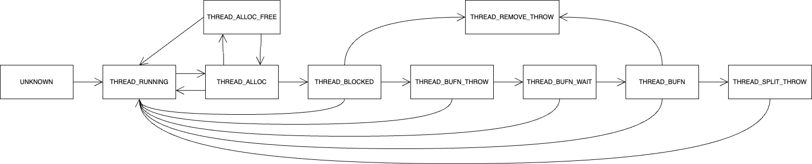

## Memory Management Overview

Effective memory management is crucial for processing queries successfully with limited memory resources.
The Spark-RAPIDS plugin leverages the [RAPIDS Memory Manager (RMM)](https://github.com/rapidsai/rmm) to handle and recover from out-of-memory (OOM) errors during query processing. This document describes the mechanisms and the state management implemented in [SparkResourceAdaptorJni.cpp](../src/main/cpp/src/SparkResourceAdaptorJni.cpp). The plugin tracks every memory allocation and deallocation request to handle various OOM situations. It chooses the appropriate recovery mechanism, such as spilling, rollback-and-retry, or split-and-retry, based on the situation. If recovery is not possible, the plugin fails gracefully.

### Handling Out-of-Memory Errors

The Spark-RAPIDS plugin manages both device memory and host memory (optional). It tracks all memory allocations to detect OOM errors. While an allocation request succeeds, the plugin does not interfere with the running threads. However, when the allocation request fails due to insufficient memory, the plugin pauses the requesting thread and allows it to retry later when more memory becomes available. The plugin employs several strategies to free up memory:

- Spilling: Data marked as spillable is moved out of memory.
- Rollback: If no thread can make progress even after spilling, the plugin starts rolling back threads to the point where their inputs are spillable, allowing other thread to proceed.
- Split and retry: If no thread can still make progress even after rolling back all threads, the inputs of some threads are split, and the threads retry with smaller data.

If no further splitting is possible, the plugin gracefully cancels the query and reports the OOM error.

### State Machine for OOM Handler

To handle various OOM situations, the Spark-RAPIDS plugin keeps track of the state of individual threads. Note that one Spark task can use multiple threads during execution.

A thread can have one of these states at a time:

- `UNKNOWN`: The thread has not been registered with the tracking system.
- `THREAD_RUNNING`: The thread is running normally and has no memory allocations pending.
- `THREAD_ALLOC`: The thread has initiated a memory allocation (either CPU or GPU).
- `THREAD_ALLOC_FREE`: A separate thread has freed memory before the allocation of this thread completes. The allocation will be retried in case that there is enough memory available after the free.
- `THREAD_BLOCKED`: The allocation request failed and the thread has been paused, waiting for more memory to become available. Note that the thread pause is usually expected to last for a short period of time as the GPU typically has a lot of memory churn. 
- `THREAD_BUFN_THROW`: A deadlock has been detected as all threads are blocked, and this thread has been selected to roll back to the point where all its data is spillable. An exception will be thrown to trigger this rollback when the thread awakes.
- `THREAD_BUFN_WAIT`: An exception has been thrown to initiate the rollback. The thread might be doing some preparation for the retry.
- `THREAD_BUFN`: The thread has rolled back and is now blocked until further notice (BUFN). The task will be unblocked once another task completes.
- `THREAD_SPLIT_THROW`: A deadlock has been detected as all threads are BUFN, and this thread has been selected to split its input and retry. Note that the processing will fail without retrying if the input cannot be further split.
- `THREAD_REMOVE_THROW`: The task has been unregistered from another thread while it is blocked. The blocked thread will be awakened to throw an exception. This should not happen under normal operation unless the Spark process is being shut down before all task threads have exited.

The thread state can change based on the diagram below. Note that the thread state can transition from any state to `UNKNOWN` unless it is blocked, either `THREAD_BLOCKED` or `THREAD_BUFN`. Thist is omitted in the diagram for brevity.

### Thread Priority

The Spark-RAPIDS plugin uses thread priority to break ties between threads.
Note that the thread priority is currently decoupled from query priority. Each task thread is assigned a priority based on their `task_id` and `thread_id`. 
Shuffle threads have the highest priority to avoid priority inversion as the task threads may depend on the shuffle indirectly.

### Deadlock Resolution

Deadlocks occur when every active task has at least one dedicated thread blocked on memory allocation, and all of the pool threads working on that task are also blocked.
The lowest priority thread (see the above [Thread priority](thread-priority) section for the thread priority) is selected to break the deadlock. There are two kinds of deadlocks.

1) All threads are blocked, either `THREAD_BLOCKED` or `THREAD_BUFN`, and there is at least one thread in the `THREAD_BLOCKED` state.
In this case, the lowest priority thread is selected among `THREAD_BLOCKED` threads to break the deadlock.
The selected thread transitions its state to `THREAD_BUFN_THROW`. Any threads that was just marked as `THREAD_BUFN_THROW` will be awakened to start the rollback process and initiate the retry.
After the rollback, all data of the thread will be spillable and the thread will be blocked before allocating more GPU memory until enough memory is freed up for other threads.
2) If all threads are in the `THREAD_BUFN` state, the lowest priority thread is selected to split its data first and then retry.
The selected thread transitions its state to `THREAD_SPLIT_THROW` and throws an exception to initiate the split-and-retry process.

### Dedicated Threads vs. Pool Threads

From the view of the OOM state machine, each task has one or more "dedicated threads", along with zero or more "pool threads". When checking whether a task is blocked, OOM state machine is lenient on dedicated threads (only require any one of the dedicated threads to be blocked), but stringent on pool threads (all pool threads must be blocked). Being treated leniently is not always a good thing, it increases the chance of being mistakenly identified as a block task, thus causing unnecessary deadlock resolution. So we don't want a thread to be treated as a dedicated thread unless it is really necessary. There are two ways of avoiding a thread being treated as a dedicated thread:

1. Avoid calling TaskContext.setTaskContext() in the current thread, this will prevent OOM state machine connecting the current thread to the task as a dedicated thread. 
2. If you have to set TaskContext, then it's also a good idea to proactively register thread itself as a pool thread instead of a dedicated thread. E.g. https://github.com/binmahone/spark-rapids/blob/581c1726b419ba93efb4302516370973ec465f52/sql-plugin/src/main/scala/com/nvidia/spark/rapids/GpuOrcScan.scala#L2058
